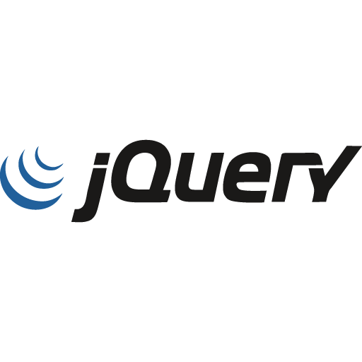
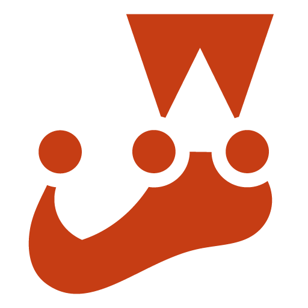

### Hi there 👋

I am a passionate and driven software engineering student currently pursuing my Bachelor's degree in Software Engineering at the African Leadership University. I am constantly seeking out new challenges and opportunities to improve my skills and contribute to the tech community.

<!-- 
-->

### Languages, Tools and Frameworks🔭

     
       

### Education 🌱

Bachelor of Software Engineering: Expected graduation in 2025 from ALU

Full-stack Web Developer: Expected graduation December 2023, ALX.

Online Courses: Completed several online courses in software development, including Javascript.

### Contact 📫 

Feel free to reach out to me at k.boafo@alustudent.com or connect with me on LinkedIn to discuss potential collaboration opportunities or just to say hello!

<!--
**kayc0des/kayc0des** is a ✨ _special_ ✨ repository because its `README.md` (this file) appears on your GitHub profile.

Here are some ideas to get you started:

- 🔭 I’m currently working on ...
- 🌱 I’m currently learning ...
- 👯 I’m looking to collaborate on ...
- 🤔 I’m looking for help with ...
- 💬 Ask me about ...
- 📫 How to reach me: ...
- 😄 Pronouns: ...
- ⚡ Fun fact: ...
-->
